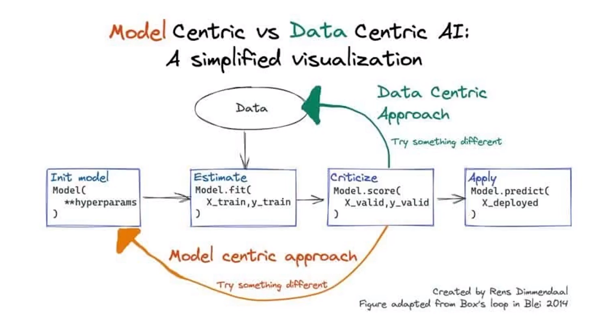

# Guia Completo de Estudos de Inteligência Artificial
## Introdução
Este guia foi criado com o intuito de ajudar pessoas que estão iniciando seus estudos em Inteligência Artificial, ou que já possuem algum conhecimento e querem se aprofundar mais no assunto.

## Parte 1: Fundamentos de Inteligência Artificial
### O que é Inteligência Artificial?
Inteligência Artificial (IA) é um ramo da ciência da computação que se propõe a elaborar **dispositivos que simulem a capacidade humana de raciocinar, perceber, tomar decisões e resolver problemas**, enfim, a capacidade de ser inteligente. A IA é um campo de estudo amplo, que abrange diversas áreas, como: aprendizado de máquina, visão computacional, processamento de linguagem natural, robótica, entre outras. 

A arte de criar máquinas que executam funções que requerem **inteligência quando executadas por pessoas** é chamada de **engenharia de IA**.

### História da Inteligência Artificial
#### Linha do tempo e marcos da Inteligência Artificial
* **1950**: Turing Test
    - Alan Turing propõe um teste para verificar se uma máquina é inteligente ou não. O teste consiste em um juiz conversar com uma máquina e com um humano, sem saber quem é quem, e tentar descobrir quem é a máquina e quem é o humano. Se o juiz não conseguir distinguir quem é a máquina e quem é o humano, a máquina é considerada inteligente.
* **1955**: A.I Born
    - John McCarthy, Marvin Minsky, Nathaniel Rochester e Claude Shannon organizam uma conferência em Dartmouth, onde o termo Inteligência Artificial é utilizado pela primeira vez.
* **1961**: Unimate
    - A primeira máquina industrial é criada. Ela é capaz de realizar tarefas repetitivas, como soldar peças de metal.
* **1964**: Eliza
    - Joseph Weizenbaum cria um programa que simula um psicólogo. O programa é capaz de conversar com pessoas e responder perguntas simples.
* **1966**: Shakey
    - Shakey é o primeiro robô móvel. Ele é capaz de se locomover em um ambiente, desviar de obstáculos e empurrar objetos.
* **1969**: A.I Winter
    - O financiamento para pesquisas em IA é cortado, devido a falta de resultados práticos.
* **1997**: Deep Blue
    - Deep Blue é um computador criado pela IBM, capaz de jogar xadrez. Ele derrota o campeão mundial de xadrez, Garry Kasparov.
* **1998**: Kismet
    - Kismet é um robô criado por Cynthia Breazeal, capaz de reconhecer expressões faciais e emoções humanas.
* **1999**: Aibo
    - Aibo é um robô criado pela Sony, capaz de reconhecer comandos de voz e se comportar como um animal de estimação.
* **2002**: Roomba
    - Roomba é um robô criado pela iRobot, capaz de aspirar o chão de uma casa.
* **2011**: Watson
    - Watson é um computador criado pela IBM, capaz de responder perguntas em linguagem natural. Ele derrota os maiores campeões do programa de TV Jeopardy.
* **2011**: Siri
    - Siri é um assistente virtual criado pela Apple, capaz de reconhecer comandos de voz e responder perguntas em linguagem natural.
* **2014**: Eugene Goostman
    - Eugene Goostman é um programa criado por Vladimir Veselov e Eugene Demchenko, capaz de simular um menino de 13 anos. Ele passa no teste de Turing.
* **2014**: Alexa
    - Alexa é um assistente virtual criado pela Amazon, capaz de reconhecer comandos de voz e responder perguntas em linguagem natural.
* **2016**: Tay
    - Tay é um chatbot criado pela Microsoft, capaz de conversar com pessoas. Ele é retirado do ar após 16 horas, por ter aprendido a fazer comentários racistas e misóginos.
* **2017**: AlphaGo
    - AlphaGo é um programa criado pela DeepMind, capaz de jogar Go. Ele derrota o campeão mundial de Go, Ke Jie.
#### Últimos avanços em Inteligência Artificial
* **2014**: GANs
    - GANs (Generative Adversarial Networks) são redes neurais artificiais capazes de gerar imagens realistas.
* **2017**: Transformer Architecture
    - Transformer Architecture é uma arquitetura de redes neurais artificiais capaz de gerar textos realistas. É a base para o GPT.

### Por que utilizar Inteligência Artificial?
A IA é uma tecnologia que pode ser utilizada **para resolver diversos problemas**, como:
* Automatizar tarefas repetitivas
    - Exemplos: 
        - Classificar e-mails como spam ou não spam
        - Classificar transações de cartão de crédito como fraudulentas ou não fraudulentas
        - Classificar imagens como gato ou cachorro
* Tomada de decisões
    - Exemplos:
        - Recomendar produtos para usuários
        - Recomendar filmes para usuários
        - Recomendar músicas para usuários
* Expereiência do usuário
    - Exemplos:
        - Chatbots
        - Assistentes virtuais
        - Carros autônomos
* Redução de custos
    - Exemplos:
        - Redução de custos com mão de obra
        - Redução de custos com infraestrutura
        - Redução de custos com manutenção
* Melhorar segurança
    - Exemplos:
        - Detecção de fraudes
        - Detecção de invasões
        - Detecção de comportamentos suspeitos
* Ampliar inovação
    - Exemplos:
        - Desenvolvimento de novos produtos
        - Desenvolvimento de novos serviços
        - Desenvolvimento de novos modelos de negócio

### Fundamentos de Inteligência Artificial
Para chegarmos onde chegamos hoje com inteligência artificial, foram necessários diversos avanços em diversas áreas, como: matemática, estatística, ciência da computação, entre outras. Nesta seção, vamos estudar os fundamentos de inteligência artificial, que são os conceitos básicos que você precisa saber para entender o que é inteligência artificial e como ela funciona.
* **Computação**
    - O computador como o artefato ideal para o sucesso da IA
    - Sistemas Operacionais
    - Linguagens de Programação
    - Algoritmos
    - Ferramentas
* **Teoria de Controle**
    - Controle Estocástico ótimo
    - Maximizar uma função objetivo sobre o tempo
    - Sistemas de controle biológico e mecânico e sua conexão com a cognição
    - Minimizar o "erro"
* **Economia**
    - Teoria da Decisão (Probabilidade + Utilidade)
    - Teoria dos Jogos (Von Neumann)
    - Adam Smith - _Economias como agentes individuais que maximizam seu bem-estar econômico_
* **Linguística**
    - NLP (Natural Language Processing)
    - Compreensão de linguagem natural
    - Representar o conhecimento de forma que o computador possa utilizar
* **Filosofia**
    - Tornou a IA concebível
    - Mente = máquina (alguns aspectos)
    - Conhecimento codificado em linguagem interna
    - Conexão entre o conhecimento e a ação
* **Matemática**
    - Compreensão da computação
    - Declarações de certeza lógica
    - Declarações incertas e probabilísticas
    - Teoria da Probabilidade
    - Máquina de Turing (1936)
* **Neurociência**
    - Redes neurais artificiais
    - Mapeamento do cérebro
    - Neurônios
    - Aplicação de modelos matemáticos ao estudo do sistema nervoso
* **Psicologia**
    - Comportamentalismo
    - Ideia que os seres humanos e animais podem ser considerados máquinas de processamento de informações
    - Processos de transformação do conhecimento bem definidos (Ciência Cognitiva)
### Subáreas da Inteligência Artificial
As subáreas da IA são as áreas que estudam os problemas específicos que a IA pode resolver. As principais subáreas da IA são:
* **Machine Learning**
    - Deep Learning
    - Predictive Analytics
* **Natural Language Processing**
    - Translation
    - Classification & Clustering
    - Information Extraction
* **Speech Recognition**
    - Speech to Text
    - Text to Speech
* **Expert Systems**
    - Knowledge Representation
    - Inference Engine
    - User Interface
* **Planning, Scheduling & Optimization**
    - Planning
    - Scheduling
    - Optimization
* **Robotics**
    - Perception
    - Manipulation
    - Navigation
* **Computer Vision**
    - Image Processing
    - Image Recognition
    - Object Detection
### Tipos de IA
A IA pode ser classificada em 3 tipos:
* **Artificial Narrow Intelligence (ANI)**
    - Também chamada de **IA Fraca**
    - É o tipo de IA mais comum que temos no nosso dia-a-dia hoje
    - É capaz de resolver problemas específicos
    - Exemplos:
        - **Chatbots**
        - **Assistentes virtuais**
* **Artificial General Intelligence (AGI)**
    - Também chamada de **IA Forte**
    - É capaz de resolver qualquer problema que um ser humano consegue resolver
    - Exemplos:
        - **Robôs**
        - **Carros autônomos**
* **Artificial Super Intelligence (ASI)**
    - Também chamada de **IA Super Forte**
    - É capaz de resolver qualquer problema que um ser humano consegue resolver, e muito mais
    - Exemplos:
        - **Sistemas de diagnóstico médico**
        - **Sistemas de previsão do tempo**
        - **Sistemas de previsão de bolsa de valores**
#### Abordagens de IA


* Model centric
    - O modelo é o centro de tudo
    - O modelo é criado e depois utilizado para resolver problemas
    - Exemplos:
        - **Redes Neurais Artificiais**
        - **Árvores de Decisão**
        - **Regressão Linear**
* Data centric
    - Os dados são o centro de tudo
    - Os dados são utilizados para criar o modelo e resolver problemas
    - Exemplos:
        - **Aprendizado de Máquina**
        - **Aprendizado Profundo**
        - **Aprendizado por Reforço**


## Parte 2: Python
Para estudarmos IA nada melhor do que utilizar uma linguagem de programação que tem **grande suporte** para essa área, nesse caso o **Python**. Vou assumir que você já tem o Python instalado em sua máquina, caso não tenha, você pode baixar o Python [aqui](https://www.python.org/downloads/). Para verificar se o Python está instalado corretamente, abra o terminal e digite o seguinte comando:
```bash
python --version
```
### Tipos primitivos
* **int**
    - Números inteiros
    - Int é a abreviação de integer, que significa inteiro
    - Exemplos:
        - 1
        - 2
        - 3
* **float**
    - Números reais
    - Float é a abreviação de floating point number, que significa número de ponto flutuante
    - Exemplos:
        - 1.0
        - 2.0
        - 3.0
* **bool**
    - Booleanos
    - Booleanos são valores lógicos, ou seja, verdadeiro ou falso
    - Exemplos:
        - True
        - False
* **str**
    - Strings
    - Strings são uma sequência de caracteres
    - Exemplos:
        - "Hello World"
        - "I'm a String"
        - "Some text"
* **list**
    - Listas
    - Listas são uma sequência de valores podendo ser de qualquer tipo
    - Exemplos:
        - [1, 2, 3]
        - [1.0, 2.0, 3.0]
        - [True, False, True]
        - ["Hello World", "I'm a String", "Some text"]
        - [1, 2.0, True, "Hello World"]
* **tuple**
    - Tuplas
    - Tuplas são uma sequência de valores podendo ser de qualquer tipo porém diferentes de listas, tuplas são imutáveis, ou seja, não podem ser alteradas depois de definidas
    - Exemplos:
        - (1, 2, 3)
        - (1.0, 2.0, 3.0)
        - (True, False, True)
        - ("Hello World", "I'm a String", "Some text")
* **dict**
    - Dicionários
    - Dicionários são uma sequência de pares chave-valor, onde cada chave é única e cada valor pode ser de qualquer tipo
    - Exemplos:
        - {"key1": 1, "key2": 2, "key3": 3}
        - {"key1": 1.0, "key2": 2.0, "key3": 3.0}
        - {"key1": True, "key2": False, "key3": True}
        - {"key1": "Hello World", "key2": "I'm a String", "key3": "Some text"}
Podemos utilizar a função **type()** para verificar o tipo de uma variável:
```python
type(1) # int
type(1.0) # float
type(True) # bool
type("Hello World") # str
```

### Funções
Funções em uma linguagem de programação são blocos de código que podem ser chamados em qualquer parte do código. Funções podem receber parâmetros e retornar valores. Para definir uma função em Python, utilizamos a palavra reservada **def**. Para retornar um valor em uma função, utilizamos a palavra reservada **return**. Para chamar uma função, utilizamos o nome da função seguido de parênteses, onde podemos passar os parâmetros da função. Exemplo:
```python
def soma(a, b):
    return a + b

soma(1, 2) # 3
```
### Estruturas de Controle
Estruturas de controle são blocos de código que permitem controlar o fluxo de execução do programa. As principais estruturas de controle são:
* **if**
    - O if é uma estrutura de controle que permite executar um bloco de código caso uma condição seja verdadeira
    - Exemplo:
        ```python
        if 1 == 1:
            print("1 é igual a 1")
        ```
* **else**
    - O else é uma estrutura de controle que permite executar um bloco de código caso uma condição seja falsa
    - Exemplo:
        ```python
        if 1 == 2:
            print("1 é igual a 2")
        else:
            print("1 não é igual a 2")
        ```
* **elif**
    - O elif é uma estrutura de controle que permite executar um bloco de código caso uma condição seja verdadeira, porém só é executado caso a condição do if seja falsa
    - Exemplo:
        ```python
        if 1 == 2:
            print("1 é igual a 2")
        elif 1 == 1:
            print("1 é igual a 1")
        else:
            print("1 não é igual a 1 nem a 2")
        ```
* **for**
    - O for é uma estrutura de controle que permite executar um bloco de código para cada elemento de uma sequência
    - Exemplo:
        ```python
        for i in [1, 2, 3]:
            print(i)
        ```
* **while**
    - O while é uma estrutura de controle que permite executar um bloco de código enquanto uma condição for verdadeira
    - Exemplo:
        ```python
        i = 0
        while i < 3:
            print(i)
            i += 1
        ```
### Classes e Objetos
Classes e objetos são conceitos muito importantes em programação orientada a objetos. Uma classe é um modelo que define os atributos e métodos de um objeto. Um objeto é uma instância de uma classe. Para definir uma classe em Python, utilizamos a palavra reservada **class**. Para criar um objeto de uma classe, utilizamos o nome da classe seguido de parênteses, onde podemos passar os parâmetros do construtor da classe. Exemplo:
```python
class Pessoa:
    def __init__(self, nome, idade):
        self.nome = nome
        self.idade = idade
```
#### Atributos
Atributos são características de um objeto. Para acessar um atributo de um objeto, utilizamos o nome do objeto seguido de um ponto e o nome do atributo. Exemplo:
```python
pessoa = Pessoa("João", 20)
pessoa.nome # João
pessoa.idade # 20
```
#### Métodos
Métodos são funções de um objeto. Para chamar um método de um objeto, utilizamos o nome do objeto seguido de um ponto e o nome do método. Exemplo:
```python
class Pessoa:
    def __init__(self, nome, idade):
        self.nome = nome
        self.idade = idade

    def falar(self):
        print("Olá, meu nome é " + self.nome + " e eu tenho " + str(self.idade) + " anos")

pessoa = Pessoa("João", 20)

pessoa.falar() # Olá, meu nome é João e eu tenho 20 anos
```
### Bibliotecas
Bibliotecas são conjuntos de funções que podem ser utilizadas em um programa. Para utilizar uma biblioteca em Python, utilizamos a palavra reservada **import**. Exemplo:
```python
import math
math.sqrt(4) # 2.0
```

## Parte 3: Ambiente de Desenvolvimento
Para começarmos a trabalhar com IA e desenvolver nossos projetos, precisamos de um ambiente de desenvolvimento. Nesta seção, vamos ver como configurar um ambiente de desenvolvimento para IA.
### Linguagens de Programação
A linguagem de programação que iremos útilizar enquanto estudamos vai ser a mais influente no mercado de IA que temos atualmente, o **Python**. Python é uma linguagem de programação de alto nível, interpretada, de script, imperativa, orientada a objetos, funcional, de tipagem dinâmica. Ela é uma linguagem de propósito geral, ou seja, pode ser utilizada para resolver diversos tipos de problemas. Python é uma linguagem de programação muito utilizada em IA, devido a sua facilidade de uso e a sua grande comunidade. Além disso, Python possui diversas bibliotecas que facilitam o desenvolvimento de projetos de IA, como: **NumPy**, **Pandas**, **Matplotlib**, **Scikit-Learn**, **TensorFlow**, **PyTorch**, entre outras.

#### Gerenciadores de versões e Ambientes Virtuais em Python
Controlar a versão do **executável de Python** que estará rodando no seu projeto, para que seja possível **trabalhar em paralelo com múltiplas versões**, sem que vire uma bagunça e Controlar as **dependências** do seu projeto, para que seja possível **trabalhar em paralelo com múltiplos projetos**. Para resolver esses problemas, existem duas ferramentas muito utilizadas no mundo Python: **pyenv** e **virtualenv**.

##### Opções de gerenciadores
* **pyenv**
    - [Install and Documentation](https://github.com/pyenv/pyenv)
    - O _pyenv_ é um gerenciador de versões de Python. Ele permite que você instale e gerencie múltiplas versões de Python no seu computador. Além disso, ele permite que você defina qual versão de Python será utilizada em cada projeto, isso é, em cada diretório você pode rodar uma versão específica de Python.
* **pipenv**
    - [Install and Documentation](https://pipenv.pypa.io/en/latest/)
    - O _pipenv_ é um gerenciador de dependências de Python. Ele permite que você instale e gerencie as dependências de cada projeto. Além disso, ele permite que você defina quais dependências serão utilizadas em cada projeto, isso é, em cada diretório você pode rodar uma versão específica de cada dependência.

##### Extensões para VSCode
Para escrevermos nosso código precisamos de um editor de código, existem muitos no mercado porém aqui vamos utilizar o _VSCode_ por ser um editor de código gratuito, open source e multiplataforma. Para facilitar o desenvolvimento de projetos em Python no VSCode, vamos utilizar algumas extensões:
* **Python**
    - [Install and Documentation](https://marketplace.visualstudio.com/items?itemName=ms-python.python)
    - Essa extensão é a extensão oficial da Microsoft para desenvolvimento de projetos em Python no VSCode. Ela possui diversas funcionalidades, como: linting, debugging, autocomplete, entre outras.
* **autoDocstring**
    - [Install and Documentation](https://marketplace.visualstudio.com/items?itemName=njpwerner.autodocstring)
    - Essa extensão é utilizada para gerar automaticamente a documentação de funções e métodos em Python.


## Parte 4: Estatística
### Introdução
Para começarmos a estudar IA, precisamos entender alguns conceitos básicos de estatística. Nesta seção, vamos estudar os conceitos básicos da **estatística descritiva**, para o uso em **análise de dados**, **exploração inicial de dados** para geração de insights e **identificação de padrões**. Estas informações podem ser usadas para escolher o **modelo de machine learning ideal** para a tarefa, para **ajustar os parâmetros** do modelo e para **avaliar o desempenho** do modelo.
#### O que é Estatística?
A estatística é a ciência que trata da coleta, organização, análise e interpretação de dados. Ela é usada em diversas áreas, como negócios, ciência, engenharia, governo e medicina.

A estatística é uma ferramenta poderosa que pode ser usada para tomar decisões informadas. Por exemplo, uma empresa pode usar a estatística para prever a demanda de um produto, para que ela possa produzir a quantidade certa de produtos e evitar desperdício. Um médico pode usar a estatística para diagnosticar uma doença, para que ele possa tratar o paciente corretamente e evitar complicações.

* **Probabilidade**
    - É a área que estuda as chances de **eventos aleatórios** acontecerem. Ela é usada para medir a incerteza de eventos, e para fazer previsões sobre o futuro.
* **Estatística Descritiva**
    - É a área que estuda como **descrever e resumir** um conjunto de dados. Ela é usada para **analisar** e **explorar** os dados, para **identificar padrões** e **gerar insights**.
* **Estatística Inferencial**
    - É a área que estuda como **fazer inferências** sobre uma população a partir de uma amostra. Ela é usada para **fazer previsões** sobre o futuro, e para **tomar decisões**.

#### População e Amostra
* **População**
    - Se refere a todo o conjunto de elementos que compartilham uma característica comum. Por exemplo, se estamos interessados nas alturas de todos os alunos de uma escola, a população é o conjunto de todas as alturas dos alunos da escola.
* **Amostra**
    - Se refere a um subconjunto da população. Por exemplo, se estamos interessados nas alturas de todos os alunos de uma escola, uma amostra pode ser o conjunto de alturas de 10 alunos da escola.
#### Tipos de Variáveis
* **Variável Qualitativa**
    - É uma variável que não pode ser medida numericamente. Por exemplo, se estamos interessados no gênero dos alunos de uma escola, a variável é qualitativa.

* **Variável Quantitativa**
    - É uma variável que pode ser medida numericamente. Por exemplo, se estamos interessados nas alturas dos alunos de uma escola, a variável é quantitativa.

#### Teorema do Limite Central
O Teorema do Ponto Central é um conceito importante na área de estatística e é frequentemente utilizado em experimentos e análises estatísticas, especialmente quando se trata de médias e distribuições de dados. Este teorema estabelece que, sob certas condições, a distribuição das médias amostrais de uma população tende a se aproximar de uma distribuição normal, mesmo que a população original não siga uma distribuição normal.

Aqui estão os principais pontos do Teorema do Ponto Central:

    Aleatoriedade das amostras: O teorema pressupõe que as amostras sejam selecionadas de forma aleatória e independente da população.

    Tamanho da amostra grande: O Teorema do Ponto Central se aplica melhor quando o tamanho da amostra é suficientemente grande. Não há um número exato que define o que é "suficientemente grande", mas geralmente, amostras com mais de 30 observações são consideradas adequadas.

    Médias amostrais aproximadamente normais: O teorema afirma que, à medida que o tamanho das amostras aumenta, a distribuição das médias amostrais se torna aproximadamente normal, independentemente da forma da distribuição da população original.

Isso é útil porque a distribuição normal é bem compreendida e permite a aplicação de técnicas estatísticas mais poderosas. Muitos testes de hipóteses e intervalos de confiança pressupõem a normalidade dos dados ou da distribuição das médias amostrais.

Em resumo, o Teorema do Ponto Central fornece uma base para a utilização da distribuição normal em muitos contextos estatísticos, tornando mais fácil realizar inferências sobre as populações a partir de amostras, desde que as condições sejam atendidas, especialmente o tamanho da amostra seja suficientemente grande.

## Parte 5: Usando Pandas no Python
Para começarmos, vamos criar um ambiente Python utilizando o **pyenv** e o **pipenv**. Para isso, vamos abrir o terminal e digitar os seguintes comandos:
```bash
mkdir Python
cd Python
mkdir estatistica
cd estatistica
pipenv install pandas --python 3.11.0
pipenv shell
```
Agora que estamos dentro do ambiente Python, vamos criar um arquivo chamado **main.py** e vamos abrir ele no VSCode. Para isso, vamos digitar os seguintes comandos no terminal:
```bash
touch main.py
code .
```
Agora que estamos com o VSCode aberto, vamos importar a biblioteca **pandas** e vamos criar um DataFrame. Para isso, vamos digitar o seguinte código no arquivo **main.py**:
    * **O que é  um Dataframe?**
        - Um dataframe é uma estrutura de dados bidimensional, tabular, heterogênea, rotulada, com eixos potencialmente heterogêneos. Ele é semelhante a uma planilha ou a uma tabela de banco de dados.
        - Para entendermos melhor, vamos criar um dicionário com os dados de 3 pessoas para nosso exemplo.
```python
import pandas as pd

dict_pessoas = {
    "nome": ["João", "Maria", "José"],
    "idade": [20, 30, 40],
    "sexo": ["M", "F", "M"]
}

## A partir do dicionário, vamos criar um dataframe

df_pessoas = pd.Dataframe.from_dict(dict_pessoas)

print(df_pessoas)
```
### Medidas de posição
Medidas de posição são medidas que resumem um conjunto de dados em um único valor, você pode lembrar delas das suas aulas de matemática. As principais medidas de posição são:
* **Média**
    - A média é a soma de todos os valores dividido pela quantidade de valores. Ela é usada para resumir um conjunto de dados em um único valor.
    - Exemplo:
        ```python
        import pandas as pd

        dict_pessoas = {
            "nome": ["João", "Maria", "José"],
            "idade": [20, 30, 40],
            "sexo": ["M", "F", "M"]
        }

        df_pessoas = pd.Dataframe.from_dict(dict_pessoas)

        print(df_pessoas["idade"].mean()) # 30
        ```
* **Mediana**
    - A mediana é o valor que separa a metade maior e a metade menor de um conjunto de dados. Ela é usada para resumir um conjunto de dados em um único valor.
    - Exemplo:
        ```python
        import pandas as pd

        dict_pessoas = {
            "nome": ["João", "Maria", "José"],
            "idade": [20, 30, 40],
            "sexo": ["M", "F", "M"]
        }

        df_pessoas = pd.Dataframe.from_dict(dict_pessoas)

        print(df_pessoas["idade"].median()) # 30
        ```
* **Moda**
    - A moda é o valor que aparece com maior frequência em um conjunto de dados. Ela é usada para resumir um conjunto de dados em um único valor.
    - Exemplo:
        ```python
        import pandas as pd

        dict_pessoas = {
            "nome": ["João", "Maria", "José"],
            "idade": [20, 30, 40],
            "sexo": ["M", "F", "M"]
        }

        df_pessoas = pd.Dataframe.from_dict(dict_pessoas)

        print(df_pessoas["idade"].mode()) # 20
        ```
### Media de dispersão
Medidas de dispersão são medidas que resumem a variabilidade de um conjunto de dados. As principais medidas de dispersão são:
* **Variância**
    - A variância é a média dos quadrados das diferenças entre cada valor e a média. Ela é usada para resumir a variabilidade de um conjunto de dados.
    - Exemplo:
        ```python
        import pandas as pd

        dict_pessoas = {
            "nome": ["João", "Maria", "José"],
            "idade": [20, 30, 40],
            "sexo": ["M", "F", "M"]
        }

        df_pessoas = pd.Dataframe.from_dict(dict_pessoas)

        print(df_pessoas["idade"].var()) # 66.66666666666667
        ```
* **Desvio Padrão**
    - O desvio padrão é a raiz quadrada da variância. Ele é usado para resumir a variabilidade de um conjunto de dados na mesma unidade de medida que os dados estão sendo analizados.
    - Exemplo:
        ```python
        import pandas as pd

        dict_pessoas = {
            "nome": ["João", "Maria", "José"],
            "idade": [20, 30, 40],
            "sexo": ["M", "F", "M"]
        }

        df_pessoas = pd.Dataframe.from_dict(dict_pessoas)

        print(df_pessoas["idade"].std()) # 8.16496580927726
        ```
* **Coeficiente de Variação**
    - O coeficiente de variação é o desvio padrão dividido pela média. Ele é usado para resumir a variabilidade de um conjunto de dados em uma porcentagem.
    - Exemplo:
        ```python
        import pandas as pd

        dict_pessoas = {
            "nome": ["João", "Maria", "José"],
            "idade": [20, 30, 40],
            "sexo": ["M", "F", "M"]
        }

        df_pessoas = pd.Dataframe.from_dict(dict_pessoas)

        print(df_pessoas["idade"].std() / df_pessoas["idade"].mean()) # 0.2721655269759087
        ```
### Medidas de Forma
Medidas de forma são medidas que resumem a forma de um conjunto de dados. As principais medidas de forma são:
* **Assimetria**
    - A assimetria é uma medida que indica o quão assimétrica é a distribuição de um conjunto de dados. Ela é usada para resumir a forma de um conjunto de dados.
    - Exemplo:
        ```python
        import pandas as pd

        dict_pessoas = {
            "nome": ["João", "Maria", "José"],
            "idade": [20, 30, 40],
            "sexo": ["M", "F", "M"]
        }

        df_pessoas = pd.Dataframe.from_dict(dict_pessoas)

        print(df_pessoas["idade"].skew()) # 0.0
        ```
* **Curtose**
    - A curtose é uma medida que indica o quão curtose é a distribuição de um conjunto de dados. Ela é usada para resumir a forma de um conjunto de dados.
    - Exemplo:
        ```python
        import pandas as pd

        dict_pessoas = {
            "nome": ["João", "Maria", "José"],
            "idade": [20, 30, 40],
            "sexo": ["M", "F", "M"]
        }

        df_pessoas = pd.Dataframe.from_dict(dict_pessoas)

        print(df_pessoas["idade"].kurtosis()) # -1.5
        ```
### Correlação
Correlação é uma medida que indica o quão relacionadas estão duas variáveis. Ela é usada para resumir a relação entre duas variáveis. As principais medidas de correlação são:
* **Covariância**
    - A covariância é uma medida que indica o quão relacionadas estão duas variáveis. Ela é usada para resumir a relação entre duas variáveis.
    - Exemplo:
        ```python
        import pandas as pd

        dict_pessoas = {
            "nome": ["João", "Maria", "José", "Ana"],
            "idade": [20, 30, 40, 50],
            "salario": [1000, 2000, 3000, 4000]
        }

        df_pessoas = pd.Dataframe.from_dict(dict_pessoas)

        print(df_pessoas["idade"].cov(df_pessoas["salario"])) # 2500.0
        ```
* **Coeficiente de Correlação de Pearson**
    - O coeficiente de correlação de Pearson é uma medida que indica o quão relacionadas estão duas variáveis. Ele é usado para resumir a relação entre duas variáveis variando entre -1 e 1, sendo ideal para ser utilizado com variáveis quantitativas.
    - Exemplo:
        ```python
        import pandas as pd

        dict_pessoas = {
            "nome": ["João", "Maria", "José", "Ana"],
            "idade": [20, 30, 40, 50],
            "salario": [1000, 2000, 3000, 4000]
        }

        df_pessoas = pd.Dataframe.from_dict(dict_pessoas)

        print(df_pessoas["idade"].corr(df_pessoas["salario"])) # 1.0
        ```
* **Coeficiente de correlação de Spearman**
    - O coeficiente de correlação de Spearman é uma medida que indica o quão relacionadas estão duas variáveis. Ele é usado para resumir a relação entre duas variáveis variando entre -1 e 1, sendo ideal para ser utilizado com variáveis quantitativas e qualitativas.
    - Exemplo:
        ```python
        import pandas as pd

        dict_pessoas = {
            "nome": ["João", "Maria", "José", "Ana"],
            "idade": [20, 30, 40, 50],
            "salario": [1000, 2000, 3000, 4000]
        }

        df_pessoas = pd.Dataframe.from_dict(dict_pessoas)

        print(df_pessoas["idade"].corr(df_pessoas["salario"], method="spearman")) # 1.0
        ``` 